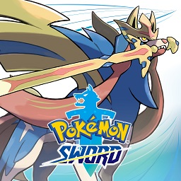

# Lyn Fares - Module 1: GitHub Pages Site
*The always tired, creative mind.*

## Hobbies:
  * Art / Drawing
  * Dungeons and Dragons
  * Voice acting
  * Video games
  * Learning new languages
  * Creative writing

## Facts About Myself:
  1. My birthdate is a repeating pattern (9/6/96)
  2. I speak English fluently and Spanish semi-fluently.
  3. I am learning to speak Japanese, Danish, German, Esperanto, and American Sign Langauge (ASL).
  4. I have played flute for 14 years and have done marching band for 10 years.
  5. I love to cook and bake.
  6. I was originally going for a degree in Elementary Education (with a minor in Early Childhood Education) before I switched to Interactive Digital Media (IDM).
  
## My Favorite Video Games:
  * Pokemon 
  
  * Super Smash Brothers 
  
  * Animal Crossing 
  
  
## My Links:
  * [LinkedIn](https://www.linkedin.com/in/lindsey-fares-4b638b192/)
  * [Twitter](https://twitter.com/lindseyfares)
  
### Image Links:
  * [Pokemon Sword Game Cover](https://www.google.com/url?sa=i&url=https%3A%2F%2Fyuzu-emu.org%2Fgame%2Fpokemon-sword%2F&psig=AOvVaw2j7gsaJ_maqsYwZZu-RhQX&ust=1598389906650000&source=images&cd=vfe&ved=0CAIQjRxqFwoTCOCd_IDitOsCFQAAAAAdAAAAABAD)
  * [Super Smash Brothers Smash Ball](https://www.google.com/url?sa=i&url=https%3A%2F%2Fgenius.com%2Falbums%2FSuper-smash-bros-brawl%2FSuper-smash-bros-brawl-official-soundtrack-smash-bros-series&psig=AOvVaw3-Crdv5WRrjlHxPpsx2xTp&ust=1598390014924000&source=images&cd=vfe&ved=0CAIQjRxqFwoTCOi_7_rgtOsCFQAAAAAdAAAAABBU)
  * [Animal Crossing: New Horizons](https://www.google.com/url?sa=i&url=https%3A%2F%2Fen.wikipedia.org%2Fwiki%2FAnimal_Crossing%3A_New_Horizons&psig=AOvVaw3VfynQW4P0dIxHpfV5Rk38&ust=1598373461318000&source=images&cd=vfe&ved=0CAIQjRxqFwoTCOCpk7WktOsCFQAAAAAdAAAAABAD)
